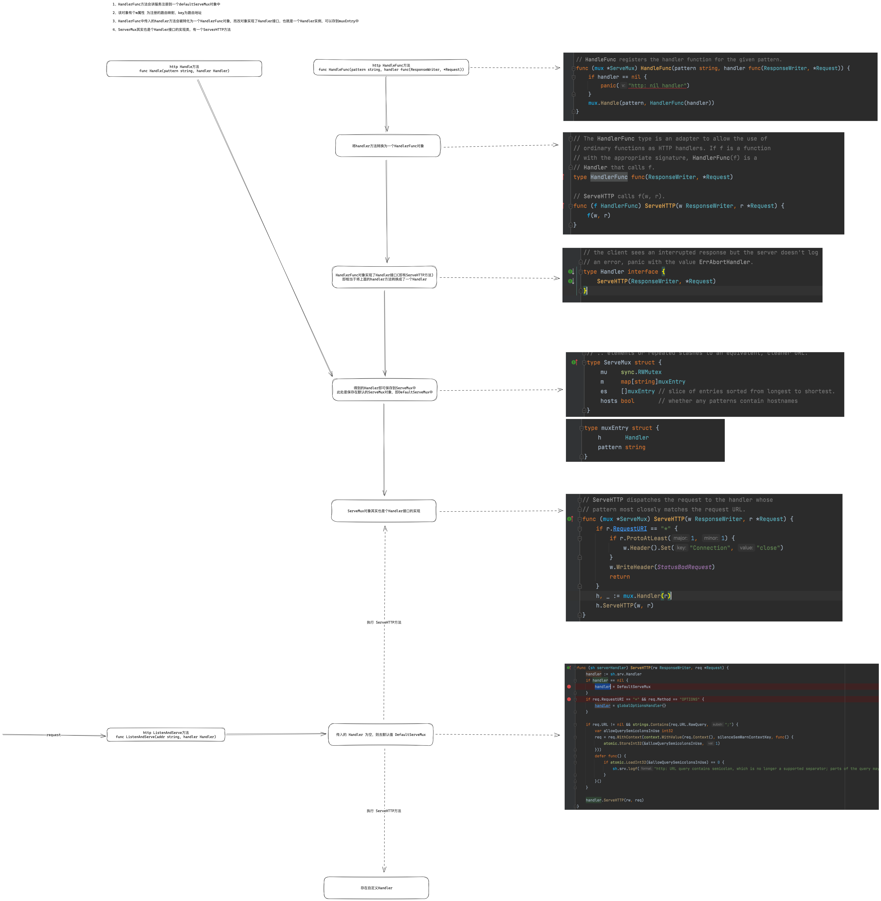

## net/http 库

#### 1、net/http.RoundTripper 
向远程发出请求的过程


#### 2、net/http.Handler 
为客户端的 HTTP 请求提供服务
```go
type Handler interface {
    ServeHTTP(ResponseWriter, *Request)
}

type ResponseWriter interface {
	Header() Header
	Write([]byte) (int, error)
	WriteHeader(statusCode int)
}
```

#### 3、客户端操作流程
net/http.Client.Get 发出 HTTP 时，会按照如下的步骤执行：
1. 调用 net/http.NewRequest 根据方法名、URL 和请求体构建请求；
2. 调用 net/http.Transport.RoundTrip 开启 HTTP 事务、获取连接并发送请求；  
3. 在 HTTP 持久连接的 net/http.persistConn.readLoop 方法中等待响应；


- net/http.Client 是 HTTP 客户端，它的默认值是使用 net/http.DefaultTransport 的 HTTP 客户端；
- net/http.Transport 是 net/http.RoundTripper 接口的实现，它的主要作用就是支持 HTTP/HTTPS 请求和 HTTP 代理；
- net/http.persistConn 封装了一个 TCP 的持久连接，是我们与远程交换消息的句柄（Handle）；

#### 4、服务端API
```go
http.HandleFunc("/", func(writer http.ResponseWriter, request *http.Request) {
    writer.Write([]byte("hello jinrruan"))
})

func HandleFunc(pattern string, handler func(ResponseWriter, *Request)) {
    DefaultServeMux.HandleFunc(pattern, handler)
}
```

```go
http.Handle("/hello", handler.GetBaseHandler())

func Handle(pattern string, handler Handler) { DefaultServeMux.Handle(pattern, handler) }
```

```go
http.ListenAndServe(":8080", nil)
```


### 遗留问题
- http获取连接，这里的连接是否可以控制，连接池自定义

### 参考
- https://draveness.me/golang/docs/part4-advanced/ch09-stdlib/golang-net-http/